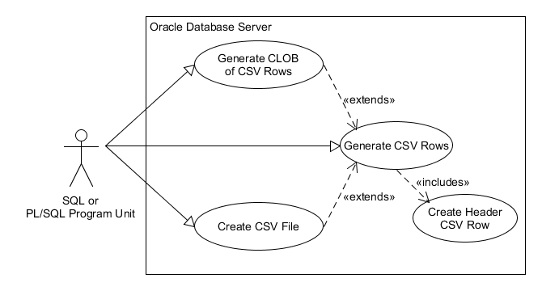

# app_csv_pkg

Create Comma Separated Value strings (rows) from an Oracle query. 

A CSV row will have the separator between each field
(can be any separator character, but comma (',') and pipe ('|') are most common).
There is no separator after the last field (which
would make it a delimited file rather than separated).

If a field contains the separator
character or newline, then the field value is enclosed in double quotes. In that case, if the field 
also contains double quotes, then those are doubled up 
per [RFC4180](https://www.loc.gov/preservation/digital/formats/fdd/fdd000323.shtml).

The resulting set of strings (rows) can be written to a file, collected into a CLOB, or selected from 
a Polymorphic Table Function.

> NOTE: Requires Oracle version 18c or higher as it depends on a Polymorphic Table Function. 
I have another github repository [app_csv_udt](https://github.com/lee-lindley/app_csv) 
that should run on Oracle 10g or better, has a few more options, and an Object Oriented
interface I prefer. I've found many people are less comfortable with the Object Oriented interface.
This is also simpler in many respects.

> ADDENDUM: There is a substantial limitation of Polymorphic Table Functions at least as of 19.6 and 20.3 (may
have been addressed in later releases) that may make
[app_csv_udt](https://github.com/lee-lindley/app_csv) a better choice. Only SCALAR
values are allowed for columns, which sounds innocuous enough, until you understand that
SYSDATE and TO_DATE('20210101','YYYYMMDD') do not fit that definition for reasons I cannot fathom.
If you have those in your cursor/query/view, you must cast them to DATE for it to work. More detail follows
at the bottom of this document.

# Content

- [Installation](#installation)
- [Use Cases](#use-cases)
    - [Generate CSV Rows](#generate-csv-rows)
    - [Create CSV FIle](#create-csv-file)
    - [Generate CLOB of CSV Rows](#generate-clob-of-csv-rows)
- [Manual Page](#manual-page)
- [Examples](#examples)
- [Issue with PTF and DATE Functions](#issue-with-ptf-and-date-functions)

# Installation

Clone this repository or download it as a [zip](https://github.com/lee-lindley/app_csv_pkg/archive/refs/heads/main.zip) archive.

Run the *install.sql* script with sqlplus:

`sqlplus YourLoginConnectionString @install.sql`

# Use Cases

|  |
|:--:|
| app_csv_pkg Use Case Diagram |

## Generate CSV Rows

You can use a SQL SELECT to read CSV strings as records from the Polymorphic Table Function *app_csv_pkg.ptf*, perhaps
spooling them to a text file with sqlplus. Given how frequently I've seen a cobbled together
SELECT concatenting multiple fields and separators into one value, this may
be the most common use case. Use of the *WITH* clause is pretty much required for Polymorphic Table Functions (although
you can provide an actual schema level table or view name instead, you probably won't).

```sql
set echo off
set linesize 300
set pagesize 0
set heading off
set trimspool on
set feedback off
spool test.csv

WITH R AS (
    SELECT last_name||', '||first_name AS "Employee Name", hire_date AS "Hire Date", employee_id AS "Employee ID"
    FROM hr.employees
    --ORDER BY last_name, first_name
) SELECT *
FROM app_csv_pkg.ptf(R, p_date_format => 'YYYYMMDD')
;
spool off
```
Sample Output:

    "Employee Name","Hire Date","Employee ID"
    "Abel, Ellen","20040511",174
    "Ande, Sundar","20080324",166
    "Atkinson, Mozhe","20051030",130

## Generate CLOB of CSV Rows

The CSV strings can be concatenated into a CLOB with linefeed (or CR/LF) after each row. The resulting CLOB can be
attached to an e-mail, written to a file or inserted/updated to a CLOB column in a table. Perhaps
added to a zip archive. There are many possibilites once you have the CSV content in a CLOB.

```sql
    DECLARE
        l_clob  CLOB;
    BEGIN
        l_clob := app_csv_pkg.get_clob(
            p_protect_numstr_from_excel => 'Y'
            ,p_sql => q'!
SELECT department_id, department_name, manager_id, TO_CHAR(location_id,'0999999') AS location_id
FROM hr.departments 
ORDER BY department_name!'
        );
        ...
    END;
    
    -- or --
SELECT app_csv_pkg.get_clob(
            p_protect_numstr_from_excel => 'Y'
            ,p_sql => q'!
SELECT department_id, department_name, manager_id, TO_CHAR(location_id,'0999999') AS location_id
FROM hr.departments 
ORDER BY department_name!'
        )
FROM dual;
```

## Create CSV File

Produce a CSV file on the Oracle server in a directory to which you have write access. Presumably
you have a process that can then access the file, perhaps sending it to a vendor. *test/test3.sql*
is a contrived example of writing the file, then using TO_CLOB(BFILENAME()) to retrieve it in a SQL statement.

```sql
DECLARE
    v_src   SYS_REFCURSOR;
BEGIN
    OPEN v_src FOR WITH R AS (
        SELECT TO_CHAR(employee_id) AS "Emp ID", last_name||', '||first_name AS "Fname", hire_date AS "Date,Hire,YYYYMMDD", salary AS "Salary"
        from hr.employees
        UNION ALL
        SELECT '999' AS "Emp ID", '  Baggins, Bilbo "badboy" ' AS "Fname", TO_DATE('19991231','YYYYMMDD') AS "Date,Hire,YYYYMMDD", 123.45 AS "Salary"
        FROM dual
      ) 
        SELECT *
        FROM app_csv_pkg.ptf(R ORDER BY "Fname"
                                ,p_num_format   => '$999,999.99'
                                ,p_date_format  => 'YYYYMMDD'
                            )

    ;
    app_csv_pkg.write_file(p_dir => 'TMP_DIR', p_file_name => 'x.csv', p_src => v_src);
END;
/

set echo off
set linesize 200
set pagesize 0
set heading off
set trimspool on
set feedback off
set long 90000
set serveroutput on
spool test3.csv
SELECT TO_CLOB(BFILENAME('TMP_DIR','x.csv')) FROM dual
;
spool off
```
You could just as easily have put the TO_CHAR conversions in your SELECT list, and in fact you should
do so if you want *p_protect_numstr_from_excel* to evaluate your converted string text. The builtin
conversions bypass that check.

Sample Output:

    "Emp ID","Fname","Date,Hire,YYYYMMDD","Salary"
    "999","  Baggins, Bilbo ""badboy"" ","19991231","     $123.45"
    "174","Abel, Ellen","20040511","  $11,000.00"
    "166","Ande, Sundar","20080324","   $6,400.00"

# Manual Page

## ptf

```sql
    --
    -- All non numeric fields will be surrounded with double quotes. Any double quotes in the
    -- data will be doubled up to conform to the RFC. Newlines in the data are passed through as is
    -- which might cause issues for some CSV parsers.
    FUNCTION ptf(
        p_tab                           TABLE
        ,p_header_row                   VARCHAR2 := 'Y'
        ,p_separator                    VARCHAR2 := ','
        --
        -- if p_protect_numstr_from_excel==Y and a varchar field looks like a number, 
        -- i.e. matches '^(\s*[+-]?(\d+[.]?\d*)|([.]\d+))$' then output '="'||field||'"'
        -- which gets wrapped with dquotes and doubled up inside quotes to "=""00123"""
        -- which makes Excel treat it like a string no matter that it wants to treat any strings that
        -- look like numbers as numbers.
        -- It is gross, but that is what you have to do if you have text fields with leading zeros
        -- or otherwise want to protect strings that look like numbers from Excel auto recognition.
        --
        ,p_protect_numstr_from_excel    VARCHAR2 := 'N'
        -- you can set these to NULL if you want the default TO_CHAR conversions
        ,p_num_format                   VARCHAR2 := NULL
        ,p_date_format                  VARCHAR2 := NULL
        ,p_interval_format              VARCHAR2 := NULL
    ) RETURN TABLE PIPELINED 
        TABLE -- so can ORDER the input
        --ROW 
        POLYMORPHIC USING app_csv_pkg
    ;
```
Parameters to *ptf* all have default values except for *p_tab*. Note that paramater values to a Polymorphic Table Function 
may not be bind variables. The reason is that the *describe* procedure is called during the hard parse phase
and bind variable values are not available when it is called. 
If you use bind variables, then *describe* receives all NULL parameter values. *describe* (and by extension *ptf*)
traps for *p_header_row* being NULL and raises the error 

> ORA20399 - app_csv_pkg.ptf was passed a NULL value for p_header_row which must be 'Y' or 'N'. You may have attempted to use a bind variable which does not work for Polymorphic Table Function parameter values.

- *p_tab*
    - The name of a schema level Table, View or Materialized View, or more likely, a Common Table Expression (CTE) (aka WITH clause).
- *p_header_row*
    - If 'Y' or 'y' (default), then a header row will be produced with the column or column alias names. The names will be double quoted. NULL is not a permitted value and will raise an exception.
- *p_separator*
    - The default value of ',' can be overriden. Common override separator characters are tab (CHR(9)), '|' and ';'.
- *p_protect_numstr_from_excel*
    - If 'Y' or 'y', then VARCHAR2 fields are examined with the regular expression
        - ^(\s*[+-]?(\d+[.]?\d\*)|([.]\d+))$
        If it matches, then we know that Excel will attempt to treat it as a number and apply an Excel format
        to the displayed value. This has an unfortunate impact of stripping leading zeros, displaying in scientific notation,
        or otherwise butchering the display of our text data. To make Excel treat it as a text value regardless,
        the accepted solution for string '000123' is to apply magic pixie dust in a CSV file with "=""000123""".
- *p_num_format*
    - If NULL, then Oracle converts using the default conversion. If instead you provide a converstion format,
    it is handed to TO_CHAR for converting any NUMBER value columns.
    You can of course
    do the conversion in your select list instead and that may be a better option.
- *p_date_format*
    - If NULL, then Oracle converts using NLS_DATE_FORMAT. You could alter your session and set NLS_DATE_FORMAT
    but that could impact other outputs and inputs depending on the default conversion. If instead you provide
    a conversion format argument, it is handed to TO_CHAR for converting any date value columns. 
    You can of course
    do the conversion in your select list instead and that may be a better option.
- *p_interval_format*
    - If NULL, then Oracle uses the default conversion. If you provide a conversion format argument, it is
    handed to TO_CHAR for converting any Interval columns.

## get_ptf_query_string

```sql
    --
    -- a) If it contains the string app_csv_pkg.ptf (case insensitive match), then it is returned as is. and your 
    --      other arguments are ignored because you should have used them directly in the PTF call.
    -- b) If it does not start with the case insensitive pattern '\s*WITH\s', then we wrap it with a 'WITH R AS (' and
    --      a ') SELECT * FROM app_csv_pkg.ptf(R, __your_parameter_vals__)' before calling it.
    -- c) If it starts with 'WITH', then we search for the final sql clause as '(^.+\))(\s*SELECT\s.+$)' breaking it
    --      into two parts. Between them we add ', R_app_csv_pkg_ptf AS (' and at the end we put
    --      ') SELECT * FROM app_csv_pkg.ptf(R_app_csv_pkg_ptf, __your_parameter_vals__)'
    -- Best thing to do is run your query through the function and see what you get. It has worked in my test cases.
    --
    FUNCTION get_ptf_query_string(
        p_sql                           CLOB
        ,p_header_row                   VARCHAR2 := 'Y'
        ,p_separator                    VARCHAR2 := ','
        -- if Y and a varchar field matches '^(\s*[+-]?(\d+[.]?\d*)|([.]\d+))$' then output '="'||field||'"'
        ,p_protect_numstr_from_excel    VARCHAR2 := 'N'
        -- you can set these to NULL if you want the default TO_CHAR conversions
        ,p_num_format                   VARCHAR2 := NULL
        ,p_date_format                  VARCHAR2 := NULL
        ,p_interval_format              VARCHAR2 := NULL
    ) RETURN CLOB
    ;
```

*get_ptf_query_string* is for internal use by *get_clob* and *write_file*, but it is made a public function
so that you can see what it does to your query which might help debug any issues. *get_clob* and *write_file*
versions that take a SQL string (CLOB) argument instead of a SYS_REFCURSOR apply this function to your query.

If it determines your query is already calling the PTF, it returns it unchanged.

If your query does not use a WITH clause, it wraps it in a single WITH clause named **R_app_csv_pkg_ptf**
like so with the values from your parameters substituted as literals (bind variables not permitted for PTF calls).

```sql
    WITH R_app_csv_pkg_ptf AS (
        ... your query ...
    ) SELECT * FROM app_csv_pkg.ptf(
                        p_tab => R_app_csv_pkg_ptf
                        ,p_header_row                   => __p_header_row__
                        ,p_separator                    => __p_separator__
                        ,p_protect_numstr_from_excel    => __p_protect_numstr_from_excel__
                        ,p_num_format                   => __p_num_format__
                        ,p_date_format                  => __p_date_format__
                        ,p_interval_format              => __p_interval_format__
                    );
```
If your query starts with WITH, then it has to get fancy and split your query into two parts. The last SELECT
in your chain of WITH clauses is wrapped in **R_app_csv_pkg_ptf** the same was shown above. Example:
```sql
    WITH abc AS (
        ...
    ), xyz AS (
        SELECT
        ...
        FROM abc
    ) --<<<< Your last WITH clause closing paren
, R_app_csv_pkg_ptf AS (
        /* your final SELECT */
    ) SELECT * FROM app_csv_pkg.ptf(
                        p_tab => R_app_csv_pkg_ptf
                        ,p_header_row                   => __p_header_row__
                        ,p_separator                    => __p_separator__
                        ,p_protect_numstr_from_excel    => __p_protect_numstr_from_excel__
                        ,p_num_format                   => __p_num_format__
                        ,p_date_format                  => __p_date_format__
                        ,p_interval_format              => __p_interval_format__
                    );
```
Using the PTF directly in your query and passing a SYS_REFCURSOR to *get_clob* or *write_file* is the best way to use
this tool. A SYS_REFCURSOR allows you to use bind variables (except for parameters to *ptf*). 
If you take advantage of the variants that accept 
a SQL string parameter, you do not have to know as much about how the PTF works and it might be a better plug and play
replacement of something you are currently using, but it is a hack I'm not especially proud of.

## get_clob [a]

```sql
    PROCEDURE get_clob(
        p_src                   SYS_REFCURSOR
        ,p_clob             OUT CLOB
        ,p_rec_count        OUT NUMBER -- includes header row
        ,p_lf_only              VARCHAR2 := 'Y'
    );
```
- *p_src*
    - The open SYS_REFCURSOR you pass is expected to have already called *app_csv_pkg.ptf*. It does
    not verify that, but it will puke if the query is not returning rows consisting of a single VARCHAR2 column.
- *p_clob*
    - The Out parameter points to a CLOB variable the CSV "file" content can be constructed in. 
    Lines are separated with LineFeed (CHR(10)) by default.
- *p_rec_count*
    - The number of lines put into the CLOB is returned in this OUT parameter. If a header row is produced, it is counted. If your query returns no rows, you still get a header row if it was requested and *p_rec_count* will be 1.
- *p_lf_only*
    - If 'Y' or 'y' (default), then lines are separated with LineFeed (CHR(10)); otherwise they are separated by Carriage Return Line Feed (CHR(13)||CHR(10)). No modern windows programs require Carriage Return; however, I have had a requirement from a vendor that a file be separated with CR/LF.

## get_clob [b]

```sql
    FUNCTION get_clob(
        p_src                   SYS_REFCURSOR
        ,p_lf_only              VARCHAR2 := 'Y'
    ) RETURN CLOB
    ;
```
This function version is the same as the preceding procedure version except you have no way to get the number of rows
produced.

## get_clob [c]

```sql
    PROCEDURE get_clob(
        p_sql                   CLOB
        ,p_clob             OUT CLOB
        ,p_rec_count        OUT NUMBER -- includes header row
        ,p_lf_only              VARCHAR2 := 'Y'
        -- these only matter if you have the procedure call the PTF for you by not including it in your sql
        ,p_header_row           VARCHAR2 := 'Y' 
        ,p_separator            VARCHAR2 := ','
        -- you can set these to NULL if you want the default TO_CHAR conversions
        ,p_num_format           VARCHAR2 := NULL
        ,p_date_format          VARCHAR2 := NULL
        ,p_interval_format      VARCHAR2 := NULL
    );
```
The first four arguments mimic the call of the first *get_clob* procedure shown above except that
we are passed a SQL string instead of a SYS_REFCURSOR. Because we are going to build the SYS_REFCURSOR
for you, you also give us values for the optional arguments to *app_csv_pkg.ptf*. We call *get_ptf_query_string*
with *p_sql* and the values of those parameters
which are then encoded in the final sql string that is opened as a cursor. 
Because this is done before the
PTF is parsed, you can use bind variables for the parameters to *get_clob*. The literal values are
encoded in the SQL that is opened as a SYS_REFCURSOR.

## get_clob [d]

```sql
    FUNCTION get_clob(
        p_sql                   CLOB
        ,p_lf_only              VARCHAR2 := 'Y'
        -- these only matter if you have the procedure call the PTF for you by not including it in your sql
        ,p_header_row           VARCHAR2 := 'Y' 
        ,p_separator            VARCHAR2 := ','
        -- you can set these to NULL if you want the default TO_CHAR conversions
        ,p_num_format           VARCHAR2 := NULL
        ,p_date_format          VARCHAR2 := NULL
        ,p_interval_format      VARCHAR2 := NULL
    ) RETURN CLOB
    ;
```
This function version is the same as the preceding procedure version except you have no way to get the number of rows
produced.

## write_file [a]

```sql
    PROCEDURE write_file(
         p_dir                  VARCHAR2
        ,p_file_name            VARCHAR2
        ,p_src                  SYS_REFCURSOR
        ,p_rec_cnt          OUT NUMBER -- includes header row
    );
```
- *p_dir*
    - Name of an Oracle directory object to which you can write.
- *p_file_name*
    - Name of file to create or replace in *p_dir*
- *p_src*
    - The open SYS_REFCURSOR you pass is expected to have already called *app_csv_pkg.ptf*. It does
    not verify that, but it will puke if the query is not returning rows consisting of a single VARCHAR2 column.
- *p_rec_count*
    - The number of lines written to the file. If a header row is produced, it is counted. If your query returns no rows, you still get a header row if it was requested and *p_rec_count* will be 1.

## write_file [b]

```sql
    PROCEDURE write_file(
         p_dir                  VARCHAR2
        ,p_file_name            VARCHAR2
        ,p_src                  SYS_REFCURSOR
    );
```
This version is the same as the preceding procedure version except you have no way to get the number of rows
produced.

## write_file [c]

```sql
    PROCEDURE write_file(
         p_dir                  VARCHAR2
        ,p_file_name            VARCHAR2
        ,p_sql                  CLOB
        ,p_rec_cnt          OUT NUMBER -- includes header row
        -- these only matter if you have the procedure call the PTF for you by not including it in your sql
        ,p_header_row           VARCHAR2 := 'Y' 
        ,p_separator            VARCHAR2 := ','
        -- you can set these to NULL if you want the default TO_CHAR conversions
        ,p_num_format           VARCHAR2 := NULL
        ,p_date_format          VARCHAR2 := NULL
        ,p_interval_format      VARCHAR2 := NULL
    );
```

The first four arguments mimic the call of the first *write_file* procedure shown above except that
we are passed a SQL string instead of a SYS_REFCURSOR. Because we are going to build the SYS_REFCURSOR
for you, you also give us values for the optional arguments to *app_csv_pkg.ptf*. We call *get_ptf_query_string*
with *p_sql* and the values of those parameters
which are then encoded in the final sql string that is opened as a cursor. 
Because this is done before the
PTF is parsed, you can use bind variables for the parameters to *write_file*. The literal values are
encoded in the SQL that is opened as a SYS_REFCURSOR.

## write_file [d]

```sql
    PROCEDURE write_file(
         p_dir                  VARCHAR2
        ,p_file_name            VARCHAR2
        ,p_sql                  CLOB
        -- these only matter if you have the procedure call the PTF for you by not including it in your sql
        ,p_header_row           VARCHAR2 := 'Y' 
        ,p_separator            VARCHAR2 := ','
        -- you can set these to NULL if you want the default TO_CHAR conversions
        ,p_num_format           VARCHAR2 := NULL
        ,p_date_format          VARCHAR2 := NULL
        ,p_interval_format      VARCHAR2 := NULL
    );

```
This version is the same as the preceding procedure version except you have no way to get the number of rows
produced.

# Examples

There are more examples in the "test" subdirectory of the repository.

## Example 0:

```sql
SELECT *
FROM app_csv_pkg.ptf(hr.employees ORDER BY (last_name, first_name, hire_date)
                        , p_date_format => 'YYYYMMDD'
                    )
WHERE rownum <= 10
;
```
Output (notice how the header row counts as one of the 10 rows! It is just a data record in the resultset.):

    "EMPLOYEE_ID","FIRST_NAME","LAST_NAME","EMAIL","PHONE_NUMBER","HIRE_DATE","JOB_ID","SALARY","COMMISSION_PCT","MANAGER_ID","DEPARTMENT_ID"
    174,"Ellen","Abel","EABEL","011.44.1644.429267","20040511","SA_REP",11000,.3,149,80
    166,"Sundar","Ande","SANDE","011.44.1346.629268","20080324","SA_REP",6400,.1,147,80
    130,"Mozhe","Atkinson","MATKINSO","650.124.6234","20051030","ST_CLERK",2800,,121,50
    105,"David","Austin","DAUSTIN","590.423.4569","20050625","IT_PROG",4800,,103,60
    204,"Hermann","Baer","HBAER","515.123.8888","20020607","PR_REP",10000,,101,70
    116,"Shelli","Baida","SBAIDA","515.127.4563","20051224","PU_CLERK",2900,,114,30
    167,"Amit","Banda","ABANDA","011.44.1346.729268","20080421","SA_REP",6200,.1,147,80
    172,"Elizabeth","Bates","EBATES","011.44.1343.529268","20070324","SA_REP",7300,.15,148,80
    192,"Sarah","Bell","SBELL","650.501.1876","20040204","SH_CLERK",4000,,123,50

## Example 1:

```sql
WITH R AS (
    SELECT last_name||', '||first_name AS "Employee Name", hire_date AS "Hire Date", employee_id AS "Employee ID"
    FROM hr.employees
    --ORDER BY last_name, first_name
) SELECT *
FROM app_csv_pkg.ptf(R ORDER BY ("Employee Name", "Hire Date")
                        , p_date_format => 'YYYYMMDD'
                    )
WHERE rownum <= 10
;
```

Output:

    "Employee Name","Hire Date","Employee ID"
    "Abel, Ellen","20040511",174
    "Ande, Sundar","20080324",166
    "Atkinson, Mozhe","20051030",130
    "Austin, David","20050625",105
    "Baer, Hermann","20020607",204
    "Baida, Shelli","20051224",116
    "Banda, Amit","20080421",167
    "Bates, Elizabeth","20070324",172
    "Bell, Sarah","20040204",192

## Example 2

```sql
SELECT app_csv_pkg.get_clob(q'[
    WITH R AS (
        SELECT last_name||', '||first_name AS "Employee Name", hire_date AS "Hire Date", employee_id AS "Employee ID"
        FROM hr.employees
        --ORDER BY last_name, first_name
    ) SELECT *
    FROM app_csv_pkg.ptf(R ORDER BY ("Employee Name", "Hire Date")
                            , p_separator => '|', p_header_row => 'N', p_date_format => 'MM/DD/YYYY'
                        )
    WHERE rownum <= 10
]'
    ) FROM dual;
```

Output is a single CLOB value that you could attach to an email or insert into a table. You would normally
be calling it inside a PL/SQL program.

    "Abel, Ellen"|"05/11/2004"|174
    "Ande, Sundar"|"03/24/2008"|166
    "Atkinson, Mozhe"|"10/30/2005"|130
    "Austin, David"|"06/25/2005"|105
    "Baer, Hermann"|"06/07/2002"|204
    "Baida, Shelli"|"12/24/2005"|116
    "Banda, Amit"|"04/21/2008"|167
    "Bates, Elizabeth"|"03/24/2007"|172
    "Bell, Sarah"|"02/04/2004"|192
    "Bernstein, David"|"03/24/2005"|151


## Example 3 

```sql
SELECT app_csv_pkg.get_clob(
        p_sql => q'[
            SELECT * 
            FROM (
                SELECT last_name||', '||first_name AS "Employee Name", hire_date AS "Hire Date", employee_id AS "Employee ID"
                FROM hr.employees
                ORDER BY last_name, first_name
            ) R
            WHERE rownum <= 10]'
        , p_separator => '|', p_header_row => 'N', p_date_format => 'MM/DD/YYYY'
       ) 
FROM dual;
```

## Example 4 (notice the '="' hack to make Excel treat the number as a string):

```sql
SELECT 
       --app_csv_pkg.get_ptf_query_string(
       app_csv_pkg.get_clob(
        p_sql => q'[
            WITH a AS (
                SELECT last_name||', '||first_name AS "Employee Name", hire_date AS "Hire Date"
                    ,'="'||employee_id||'"' AS "Employee ID"
                FROM hr.employees
                ORDER BY last_name, first_name
            ) SELECT *
            FROM a
            WHERE rownum <= 10]'
        , p_separator => ',', p_header_row => 'Y', p_date_format => 'MM/DD/YYYY'
       ) 
FROM dual;
```

The query it runs for you as shown by the call to *get_ptf_query_string* that is commented out above is:
```sql

            WITH a AS (
                SELECT last_name||', '||first_name AS "Employee Name", hire_date AS "Hire Date"
                    ,'="'||employee_id||'"' AS "Employee ID"
                FROM hr.employees
                ORDER BY last_name, first_name
            )
, R_app_csv_pkg_ptf AS (
 SELECT *
            FROM a
            WHERE rownum <= 10
)
    SELECT * FROM app_csv_pkg.ptf(
                        p_tab           => R_app_csv_pkg_ptf
                        ,p_header_row   => 'Y'
                        ,p_separator    => ','
                        ,p_date_format  => 'MM/DD/YYYY'
                        ,p_interval_format => NULL
                  )
```
The results including the hack with the '=' follow. That syntax of doubling up the dquotes inside a double quoted
string conforms with the RFC and excel interprets it correctly. You might do this if you have string with leading zeros
that Excel wants to automatically convert to numbers, or perhaps very large numbers that excel wants to display with
exponents.

    "Employee Name","Hire Date","Employee ID"
    "Abel, Ellen","05/11/2004","=""174"""
    "Ande, Sundar","03/24/2008","=""166"""
    "Atkinson, Mozhe","10/30/2005","=""130"""
    "Austin, David","06/25/2005","=""105"""
    "Baer, Hermann","06/07/2002","=""204"""
    "Baida, Shelli","12/24/2005","=""116"""
    "Banda, Amit","04/21/2008","=""167"""
    "Bates, Elizabeth","03/24/2007","=""172"""
    "Bell, Sarah","02/04/2004","=""192"""
    "Bernstein, David","03/24/2005","=""151"""

## Example 5 letting the PTF apply the '="' hack

```sql
SELECT 
       --app_csv_pkg.get_ptf_query_string(
       app_csv_pkg.get_clob(
        p_sql => q'[
            WITH a AS (
                SELECT last_name||', '||first_name AS "Employee Name", hire_date AS "Hire Date"
                    ,TO_CHAR(employee_id, '099999999999') AS "Employee ID"
                FROM hr.employees
                ORDER BY last_name, first_name
            ) SELECT *
            FROM a
            WHERE rownum <= 10]'
        , p_separator => ',', p_header_row => 'Y', p_date_format => 'MM/DD/YYYY'
        , p_protect_numstr_from_excel => 'Y'
       ) 
FROM dual;
```
Results:

    "Employee Name","Hire Date","Employee ID"
    "Abel, Ellen","05/11/2004","=""000000000174"""
    "Ande, Sundar","03/24/2008","=""000000000166"""
    "Atkinson, Mozhe","10/30/2005","=""000000000130"""
    "Austin, David","06/25/2005","=""000000000105"""
    "Baer, Hermann","06/07/2002","=""000000000204"""
    "Baida, Shelli","12/24/2005","=""000000000116"""
    "Banda, Amit","04/21/2008","=""000000000167"""
    "Bates, Elizabeth","03/24/2007","=""000000000172"""
    "Bell, Sarah","02/04/2004","=""000000000192"""
    "Bernstein, David","03/24/2005","=""000000000151"""

## Issue with PTF and DATE Functions

Beware if your query produces a calculated date value like TO_DATE('01/01/2021','MM/DD/YYYY') or SYSDATE,
or is from a view that does something similar. This datatype is an "in memory" DATE (as opposed to a schema
object type DATE) and is
not a supported type. It throws the PTF engine into a tizzy. 
You must cast the value to DATE if you want to use it in a PTF:

    SELECT CAST( TO_DATE('01/01/2021','MM/DD/YYYY') AS DATE ) AS mycol
    -- or --
    SELECT CAST(SYSDATE AS DATE) AS mycol

You can't even trap it in the PTF function itself because you don't get
to put any code there; it is generated by the SQL engine before it ever calls the PTF DESCRIBE method.
The *app_csv_pkg.write* and *app_csv_pkg.get_clob* procedures that take a SQL string as input will trap that error and 
report it in a little more helpful way, but if you are opening your own sys_refcursor, you will get ORA62558,
and the explanation is less than helpful. This [post](https://blog.sqlora.com/en/using-subqueries-with-ptf-or-sql-macros/)
is where I found out about the cause.

I have seen an article that suggests it has been addressed in some releases at least in terms of SQL macros.
The list of supported types in DBMS_TF in 20.3 has
TYPE_EDATE listed as 184, but the query is giving type 13 and calling the PTF with that CTE
is returning ORA-62558 exception. Maybe something about SQL macros works around it, but I haven't
gone there yet and I may not have understood the article.

